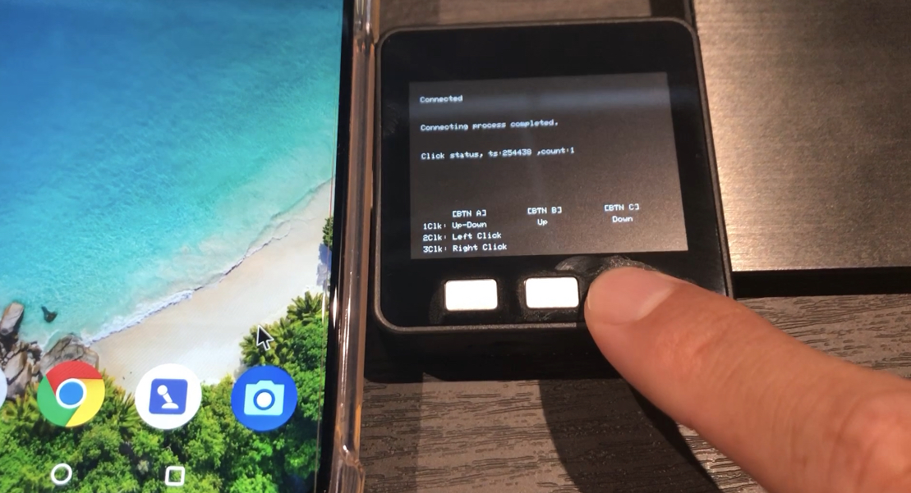

This sample sketch make M5Stack working as a BLE HOGP(HID Over GATT Profile) mouse.

- It works on ChromeOS/Windows/Android/iPadOS devices. I didn't tested in MacOS.

## Usage

1. After boot up, scan and connect from BLECentral.
1. M5stack Left button recognize multiple clicks.
    - Single click: Change direction, up-down mode <-> right-left mode.
    - Double click: Emulates mouse click(left button).
    - Triple click: Emulates mouse click(right button).
1. M5stack Middle button moves cursol to up or left.
1. M5stack Right button moves cursol to down or right.

## Development requirements and notices

- Arduino IDE
- If you change HID report map structure, you need to unpair M5Stack and BLECentral.

## Acknowledgment

This program is much inspired by [M5StackHIDCtrlAltDel](https://github.com/mhama/M5StackHIDCtrlAltDel).

## License

MIT
